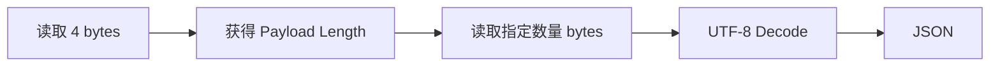
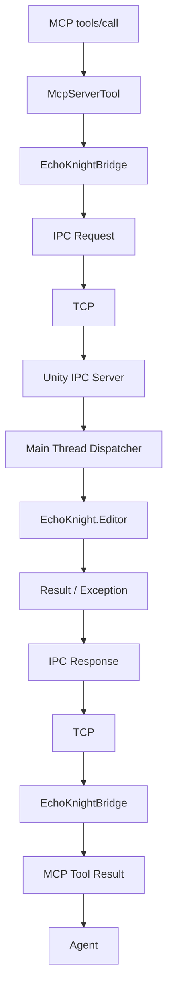

# EchoKnight.Mcp v1 架构设计

## 1. 项目目标

`EchoKnight.Mcp` 用于将 EchoKnight 已有的 Unity Editor 能力通过 MCP 暴露给外部智能体，使 MCP Client 可以调用 EchoKnight 提供的编辑器工具。

整体调用链：


设计原则：

- MCP Server 不直接依赖 `UnityEngine` / `UnityEditor`。
- Unity Editor 不依赖 MCP SDK。
- MCP 与 EchoKnight 之间通过独立 IPC 边界解耦。
- v1 以完成可靠、清晰的端到端调用链为目标，不引入不必要的抽象和并发机制。

---

## 2. 进程模型

### 2.1 MCP Server

`EchoKnight.Mcp.Server` 为独立的 .NET 进程：`EchoKnight.Mcp.Server.exe`，且Server 不嵌入 Unity Editor 进程。当前运行环境如下：

```text
.NET 8
ModelContextProtocol C# SDK v2.2.0
```

### 2.2 Server 启动方式

MCP Server 由 MCP Client / Agent 按需启动：

```text
MCP Client
    │
    │ Create Process
    ▼
EchoKnight.Mcp.Server
```

Server 的进程生命周期由 MCP Client 管理，Unity Editor 不负责启动 MCP Server。即：

```text
Lifetime(MCP Server) ⊆ Lifetime(MCP Client)
```

### 2.3 Unity Editor

Unity Editor 独立运行：

```text
Unity Editor
    │
    ▼
EchoKnight.Editor
```

EchoKnight 的正常 Editor 功能不依赖 MCP Server 是否存在。因此 MCP 属于 EchoKnight 的：**可选外部接口层**，而不是 EchoKnight Editor 自身的运行基础设施。

---

## 3. MCP 通信

MCP Client 与 `EchoKnight.Mcp.Server` 使用：`MCP over stdio`，结构：

```text
MCP Client
    │
    │ stdin / stdout
    ▼
EchoKnight.Mcp.Server
```

MCP Client 创建 Server 进程时建立并持有对应的 stdin/stdout。Server 当前使用：

```csharp
builder.Services
 .AddMcpServer()
 .WithStdioServerTransport()
 .WithToolsFromAssembly();
```

MCP Tool 通过：`[McpServerToolType]`和`[McpServerTool]`进行注册和暴露。

---

## 4. Unity IPC

### 4.1 IPC Transport

`EchoKnight.Mcp.Server` 与 Unity Editor 之间采用：`TCP Socket`，仅用于本机 IPC。网络地址限制为：`127.0.0.1`。

### 4.2 Client / Server 角色

角色固定为：Unity Editor = TCP Server、EchoKnight.Mcp.Server = TCP Client。启动关系：

```text
  Unity Editor Start
        ↓
EchoKnight IPC Server Start
        ↓
      Listen
        ↓
    等待连接


   MCP Client
        ↓
启动 EchoKnight.Mcp.Server
        ↓
  EchoKnightBridge
        ↓
   Connect Unity
```

Unity 是 EchoKnight 能力提供方，因此负责提供 IPC Endpoint。MCP Server 是能力调用方，因此主动连接 Unity。

---

## 5. EchoKnightBridge

MCP Server 侧定义：`EchoKnightBridge`，作为 MCP Server 与 Unity Editor 之间唯一的通信入口。调用关系：


### 5.1 Bridge 职责

- TCP 连接管理
- Request 发送
- Response 接收
- 消息序列化 / 反序列化
- 通信异常处理
- 超时处理

### 5.2 MCP 与 Bridge 的依赖方向

依赖关系保持：

```text
MCP Layer
    │
    ▼
EchoKnight IPC Layer
```

`McpServerTool` 可以知道 `EchoKnightBridge`，`EchoKnightBridge` 不知道 MCP Tool、MCP SDK 等上层概念。

---

## 6. IPC 消息传输

TCP 是字节流协议，本身不存在消息边界，因此 EchoKnight IPC 需要自行定义 Message Framing。v1 使用`Length Prefix + UTF-8 JSON`，单条消息：

```text
┌─────────────────┬─────────────────────────┐
│ Length          │ JSON Payload            │
│ 4 bytes         │ N bytes                 │
└─────────────────┴─────────────────────────┘
```

处理过程：



---

## 7. Request 协议

Request 统一采用：

```json
{
 "id": "request-id",
 "method": "tool_name",
 "params": {}
}
```

- **id**：由 `EchoKnightBridge` 生成。主要用于：
  - Request / Response 一致性校验
  - 日志追踪
  - 通信异常检测
- **method**：即`MCP Tool Name`，如`{ "method": "get_scene_info" }`，Unity 根据 `method` 分发对应操作
- **params**：对应 MCP：`tools/call.arguments`

    ```json
    {
        "arguments": {
        "width": 256,
        "length": 256,
        "chunkSize": 32
        }
    }
    ```

---

## 8. Response 协议

Response 使用统一结构：

```json
// 成功
{
 "id": "request-id",
 "success": true,
 "result": {},
 "error": null
}

// 失败
{
 "id": "request-id",
 "success": false,
 "result": null,
 "error": {
  "code": "ERROR_CODE",
  "message": "Error message"
 }
}
```

字段定义：

| 字段 | 作用 |
| --- | --- |
| `id` | 对应 Request ID |
| `success` | 请求是否成功执行 |
| `result` | 成功时的 JSON 结果 |
| `error` | 失败时的错误信息 |

协议约束：

```text
success == true
    result 有效
    error = null

success == false
    result = null
    error 有效
```

---

## 9. Request 执行模型

EchoKnight IPC v1 **不支持并发 Request**。同一个连接中采用严格的串行 Request/Response：

```text
 Request A
    ↓
   等待
    ↓
Response A
    ↓
 Request B
    ↓
   等待
    ↓
Response B
```

不允许：

```text
Request A
Request B
    ↓
同时等待
```

因此 `EchoKnightBridge` 不需要维护复杂的 Pending Request Dictionary。

基本流程：

```text
Send Request
    ↓
Wait Response
    ↓
验证 Response.Id
    ↓
Return
```

v1 优先保证协议和 Unity 执行链稳定，暂不引入并发请求调度。

---

## 10. Unity 主线程模型

TCP I/O 不在 Unity Editor 主线程执行，原因是 EchoKnight 后续大量功能涉及：

```text
UnityEngine
UnityEditor
GameObject
Scene
SceneView
AssetDatabase
Undo
Selection
Prefab
...
```

相关操作需要在 Unity 主线程执行，因此 Unity 侧执行模型为：

```text
TCP Background Thread
        │
        │ Request
        ▼
EditorMainThreadDispatcher
        │
        ▼
Unity Main Thread
        │
        ▼
Request Dispatch
        │
        ▼
EchoKnight.Editor
```

### 10.1 EditorMainThreadDispatcher

定义轻量：`EditorMainThreadDispatcher`，职责只有：**将后台线程提交的工作切换到 Unity Editor 主线程执行，并异步返回执行结果**。概念接口：

```csharp
Task<T> InvokeAsync<T>(Func<T> action);
```

v1 暂定使用：`EditorApplication.delayCall + TaskCompletionSource`实现线程切换。执行链：

```text
TCP Thread
    │
    │ InvokeAsync
    ▼
EditorApplication.delayCall
    │
    ▼
Unity Main Thread
    │
    │ action()
    ▼
TaskCompletionSource
    │
    ▼
TCP Thread
```

---

## 11. 异常传播

Unity 业务执行过程中产生的异常需要沿调用链返回：

```text
EchoKnight.Editor
        │
        │ Exception
        ▼
EditorMainThreadDispatcher
        │
        ▼
Unity IPC Server
        │
        │ 转换
        ▼
IPC Error Response
        │
        ▼
EchoKnightBridge
        │
        ▼
McpServerTool
        │
        ▼
MCP Client
```

Unity IPC Server 负责将内部异常转换为协议定义的：

```json
{
 "success": false,
 "result": null,
 "error": {
  "code": "...",
  "message": "..."
 }
}
```

而不是直接将 .NET Exception 对象跨进程传输。

---

## 12. v1 总体架构

最终结构：

```text
┌───────────────────────────────┐
│ MCP Client / Agent            │
└───────────────┬───────────────┘
                │
                │ MCP / stdio
                ▼
┌───────────────────────────────┐
│ EchoKnight.Mcp.Server         │
│                               │
│  McpServerTool                │
│        │                      │
│        ▼                      │
│  EchoKnightBridge             │
│        │                      │
└────────┼──────────────────────┘
         │
         │ TCP / 127.0.0.1
         │ Length Prefix
         │ UTF-8 JSON
         ▼
┌───────────────────────────────┐
│ Unity Editor                  │
│                               │
│  EchoKnight IPC Server        │
│        │                      │
│        ▼                      │
│  EditorMainThreadDispatcher   │
│        │                      │
│        ▼                      │
│  Request Dispatch             │
│        │                      │
│        ▼                      │
│  EchoKnight.Editor            │
└───────────────────────────────┘
```

完整一次调用：


