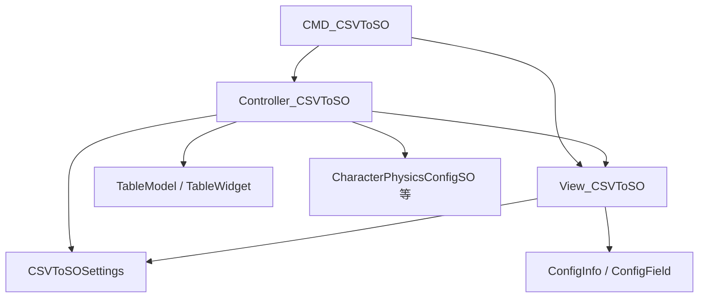

# CSV 转 ScriptableObject — 设计说明

## 1. 功能目标

在编辑器中，将策划维护的 CSV 表格导入为可编辑表格，批量生成或更新对应的 `ScriptableObject` 资源，并支持将表格改动写回 CSV。

| 能力 | 说明 |
|------|------|
| 配置类型 | 扫描带 `[ConfigInfo]` 的 `ScriptableObject` 子类，下拉选择 |
| CSV 导入 | 选择 `.csv` 的 `TextAsset`，解析为 `TableModel` 并在 UI 表格中展示、编辑 |
| 生成 SO | 按行创建或更新 `.asset`，支持 `Undo` |
| 回写 CSV | 将当前表格数据写回磁盘（`EditorDataLoader.SaveCSV`） |
| 会话恢复 | `CSVToSOSettings` 保存上次 CSV、路径、配置类型索引 |

## 2. 模块划分



| 模块 | 路径 | 职责 |
|------|------|------|
| 入口 | `Editor/Commands/CMD_CSVToSO.cs` | 打开/关闭面板 |
| 视图 | `Editor/View/View_CSVToSO.cs` | 配置类型、路径、CSV、表格、「生成」「更新配置」 |
| 控制 | `Editor/Controller/Controller_CSVToSO.cs` | CSV 解析、表头生成、SO 读写、持久化界面状态 |
| 参数 | `Editor/Model/Model_CSVToSO.cs` | CSV 资源、保存路径、配置类型索引 |
| 设置 | `Editor/Settings/CSVToSOSettings.cs` | `ProjectSettings/CSVToSO.asset`，跨会话恢复 UI |

`CMD_CSVToSO` 只管理面板生命周期；解析与生成逻辑在 Controller 中，按配置类型分支（当前为硬编码）。

## 3. 用户界面

### 3.1 分组（自上而下）

| 分组 | 控件 |
|------|------|
| 配置 | 配置类型（`PopupField`，来自 `[ConfigInfo]`） |
| 路径 | SO 存储路径（`PathField`） |
| 数据 | 配置文件（`ObjectField`，`TextAsset`） |
| 表格 | `TableWidget`（有数据时显示，默认可编辑列） |

### 3.2 底栏

| 按钮 | 说明 |
|------|------|
| 生成 | 按表格行批量创建/更新 SO |
| 更新配置 | 将表格写回 CSV 文件 |

### 3.3 视图事件

| 事件 | 触发 |
|------|------|
| `ConfigChanged` | 切换配置类型 |
| `CSVFileChanged` | 选择合法 `.csv` 后 |
| `GenerateClicked` | 生成 |
| `UpdateClicked` | 更新配置（回写 CSV） |

## 4. 用户流程

### 4.1 导入并生成 SO

1. 在工具箱打开 **CSV转ScriptableObject** 面板。
2. 选择 **配置类型**、**SO 存储路径**、**配置文件**（`.csv`）。
3. 表格加载 CSV 行，可单元格编辑。
4. 点击 **生成**：按行以第 0 列作为 `{name}.asset` 文件名写入 `ConfigSavePath`。

### 4.2 编辑并回写 CSV

1. 在表格中修改数据。
2. 点击 **更新配置**：调用 `EditorDataLoader.SaveCSV` 写回当前 CSV 路径。

### 4.3 校验

| 条件 | 处理 |
|------|------|
| 所选文件非 `.csv` | 警告，清空 `ObjectField` |
| 表格无数据时生成/更新 | 提示，不继续 |
| CSV 路径无效时回写 | 提示，不继续 |
| 某行第 0 列（角色类型）为空 | 跳过该行并警告（`CharacterPhysicsConfigSO`） |
| CSV 行少于 6 列 | 跳过该行并报错（当前类型） |

## 5. 数据与生成规则

### 5.1 配置类型发现

`View_CSVToSO` 通过 `TypeCache.GetTypesDerivedFrom<ScriptableObject>()` 扫描，仅保留带 `[ConfigInfo]` 的类型，显示名为 `ConfigInfo.ConfigName`。

### 5.2 表头生成

`InitTableTitle`：对当前 SO 类型的 public 实例字段反射，取 `[ConfigField].FieldName` 或字段名作为列标题，列类型均为 `string`。

### 5.3 已实现的配置类型

**`CharacterPhysicsConfigSO`**（`[ConfigInfo("角色物理属性")]`）

| 列序 | 字段 | 说明 |
|------|------|------|
| 0 | `characterType` | 资产文件名 `{value}.asset` |
| 1～5 | `gravity`、`groundGravity`、`rotationFactorPerFrame`、`maxJumpHeight`、`maxJumpTime` | `ParseFloat` 赋值 |

切换为其他配置类型时：`InitTable` 仅清空表格，无 `ReadCSVFile` / `GenerateSO` 分支。

### 5.4 数据流

```
CSV (TextAsset)
  → ReadCSVFile → TableModel + TableWidget
  → 用户编辑
  → GenerateSO → .asset（Undo 创建/修改）
  → UpdateCSVFile → 磁盘 CSV
```

生成或回写成功后：`CSVToSOSettings.instance.viewData = m_view.GetData()` 并 `Save()`。

## 6. 控制器职责

### 6.1 状态

| 字段 | 说明 |
|------|------|
| `m_currentConfigType` | 当前选中的 SO 类型 |
| `m_tableModel` | 表格数据 |
| `m_csvAsset` | 当前 CSV `TextAsset` |

### 6.2 构造

从 `CSVToSOSettings` 恢复 `View.InitData`；订阅 View 事件；按保存的 `configIndex` 调用 `InitTable`，若有 CSV 则 `ReadCSVFile`。

### 6.3 InitTable

更新 `m_currentConfigType`，`ClearTable`。

### 6.4 ReadCSVFile

按 `m_currentConfigType` 分支解析（当前仅 `CharacterPhysicsConfigSO`）。CSV 按行 `Split('\n')`，数据行 `Split(',')`（未处理引号内逗号）。

### 6.5 GenerateSO

校验行数 → 分支生成 → `AssetDatabase.SaveAssets` / `Refresh` → 持久化界面状态。

### 6.6 UpdateCSVFile

校验行数与 CSV 路径 → `EditorDataLoader.SaveCSV` → 持久化界面状态。

### 6.7 Dispose

解绑 View 事件。

## 7. 命令生命周期

**Execute**：无活动窗口则返回 → 新建 `View_CSVToSO`、`Controller_CSVToSO` → `AddElement`。

**Undo（关闭面板）**：`Dispose` Controller → `RemoveElement` → 清空引用。不撤销已生成的 SO 或已写回的 CSV（资源级 Undo 在生成操作内单独注册）。

## 8. 参数模型（Model_CSVToSO）

| 字段 | 说明 |
|------|------|
| `csvfileAsset` | 当前 CSV `TextAsset` |
| `configSavePath` | SO 输出目录 |
| `configIndex` | 配置类型下拉索引 |

持久化于 `CSVToSOSettings.instance.viewData`。

## 9. 实现进度

| 项 | 状态 |
|----|------|
| `View_CSVToSO` 布局与事件 | 已完成 |
| `CMD_CSVToSO` 打开/关闭面板 | 已完成 |
| `CharacterPhysicsConfigSO` 导入/生成/回写 | 已完成 |
| 配置类型扫描与表头反射 | 已完成 |
| 其他 `[ConfigInfo]` 类型 | 未实现（仅清空表格） |
| 通用 CSV 解析（引号、类型列） | 未实现 |

## 10. 待办

- [ ] 新增配置类型：在 Controller 增加 `LoadXxx` / `GenerateXxxSO` 或抽取通用分支
- [ ] 切换非支持类型时的明确提示
- [ ] 改进 CSV 解析（引号内逗号、表头行校验）
- [ ] 统一 `ParseFloat` 与列类型校验，减少硬编码列数
