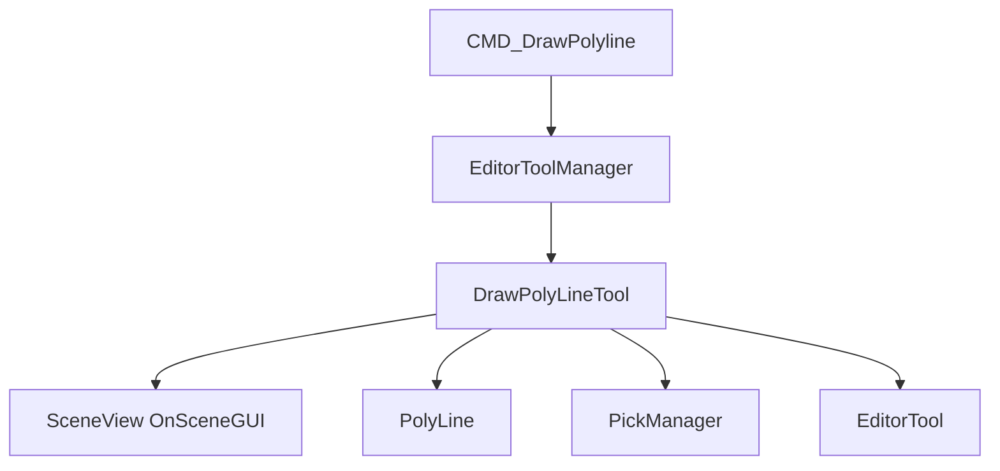

# 绘制多段线 — 设计说明

## 1. 功能目标

在 Scene 视图中通过点击放置顶点，实时预览折线，完成后在场景中创建带 `PolyLine` 组件的 GameObject，供关卡编辑与「沿线布设」等流程使用。

| 能力 | 说明 |
|------|------|
| 顶点放置 | 左键在拾取平面上添加顶点 |
| 实时预览 | 已定点折线 + 末段跟随鼠标的预览线 |
| 完成/取消 | 右键菜单、Enter / Esc；少于 2 点不创建对象 |
| 闭合检测 | 首尾重合时去重末点并 `SetClosed(true)` |
| 编辑器集成 | Tag `Polyline`、`PickManager` 注册、创建 Undo |

## 2. 模块划分

| 模块 | 路径 | 职责 |
|------|------|------|
| 入口 | `Editor/Commands/CMD_DrawPolyline.cs` | `SetTool(new DrawPolyLineTool())` |
| 工具 | `Editor/Tool/PolyLine/DrawPolyLineTool.cs` | 输入、预览、创建场景对象 |
| 运行时 | `Echo.Component.PolyLine` | 局部顶点、闭合、线宽与颜色 |
| 工具基类 | `Editor/Utils/EditorTool` | 射线求交、闭合判定、Tag 管理 |

`CMD_DrawPolyline` 仅切换场景工具；绘制逻辑全部在 `DrawPolyLineTool` 中。

## 3. 用户界面

本命令无面板 UI，交互均在 Scene 视图完成。

| 输入 | 行为 |
|------|------|
| 左键 | 在 `m_lastPt` 处添加顶点 |
| 鼠标移动 | 更新预览终点 |
| 右键 | 上下文菜单：「确定」「取消」 |
| Enter / Esc | 调用 `Finish()`（与「确定」相同结束逻辑） |

## 4. 用户流程

### 4.1 绘制并完成

1. 在工具箱选择 **绘制多段线**，进入 `DrawPolyLineTool`。
2. 左键依次放置顶点；移动鼠标查看预览。
3. 右键 **确定** 或按 Enter：点数 ≥ 2 时创建对象并退出工具。
4. 场景中生成名为 `"多段线"`、Tag 为 `Polyline` 的 GameObject，挂 `PolyLine`，首点为世界原点。

### 4.2 取消

- 右键 **取消**：清空点集，`ClearTool()`。
- Enter / Esc 在点数 < 2 时：`Finish` 内直接 `ClearTool()`，不创建对象。

### 4.3 校验

| 条件 | 处理 |
|------|------|
| 完成时点数 < 2 | 不创建 GameObject，仅退出工具 |
| Tag `Polyline` 不存在 | `EditorTool.AddTag` 后创建 |

## 5. 坐标与 PolyLine 创建

### 5.1 拾取

- 默认平面：`Plane(Vector3.up, Vector3.zero)`，经 `EditorTool.HitPosition` 求世界坐标。
- 射线失败时回退：`(mouse.x, 0, mouse.y)`。

### 5.2 CreatePolyLine

1. `polyLineGO.transform.position = m_points[0]`。
2. 各顶点转为以首点为原点的局部坐标写入 `PolyLine`。
3. `EditorTool.IsPolyLineClosed(m_points)` 为真：移除重复末点，`SetClosed(true)`。

### 5.3 完成时副作用

- `Undo.RegisterCreatedObjectUndo(polyLineGO, "Draw PolyLine")`
- `PickManager.Register(polyLineGO, polyline)`
- `EditorToolManager.ClearTool()`

## 6. 工具职责

### 6.1 状态

| 字段 | 说明 |
|------|------|
| `m_state` | `Idle` / `Running` / `Completed` / `Cancelled` |
| `m_points` | 世界空间顶点列表 |
| `m_lastPt` | 当前预览点 |
| `m_sceneView` | 构造时绑定 `RPGEditorToolWindow.ActiveWindow.SceneView` |

### 6.2 Activate / DeActivate

- **Activate**：`m_state = Running`。
- **DeActivate**：`ResetTool()`（清空点集，状态回 `Idle`），不保留未完成点列。

### 6.3 OnSceneGUI

`HandleInput` → `DrawPreview`（`Handles.DrawAAPolyLine` + 末段预览线）。

### 6.4 Finish / Cancel

见 §4；`Finish` 将 `m_state` 设为 `Completed` 后创建或清空退出。

## 7. 命令生命周期

**Execute**：`EditorToolManager.SetTool(new DrawPolyLineTool())`（停用上一工具并激活新工具）。

**Undo**：空实现。关闭绘制或撤销结果依赖工具内取消，或 Unity 对 `RegisterCreatedObjectUndo` 的撤销；命令层不负责回滚工具切换。

## 8. 常量与约定

| 项 | 值 |
|----|-----|
| GameObject 名称 | `"多段线"` |
| Tag | `"Polyline"` |
| 拾取平面 | Y=0 水平面 |

## 9. 与沿线布设的关系

`CMD_LinePlacement` 通过 `SelectionTool` 筛选带 `PolyLine` 的对象作为布设路径；本工具产出的多段线即其路径数据来源之一。`LinePlacement` 的「绘制并布设」将复用 `DrawPolyLineTool`（带完成回调，见 `CMD_LinePlacement` 设计说明）。

## 10. 实现进度

| 项 | 状态 |
|----|------|
| `DrawPolyLineTool` 点击/预览/完成/取消 | 已完成 |
| `CMD_DrawPolyline` 切换工具 | 已完成 |
| `CMD_DrawPolyline.Undo` | 未实现 |
| 完成回调构造（供沿线布设） | 未实现（当前仅无参构造） |
| 吸附、Shift 约束、自定义高度平面 | 未实现 |

## 11. 待办

- [ ] `CMD_DrawPolyline.Undo`：`ClearTool()` 并可选记录工具切换 Undo
- [ ] `DrawPolyLineTool` 支持 `onComplete` 回调（与 `LinePlacement` 联动）
- [ ] 可配置拾取平面或高度
- [ ] 吸附与轴向约束
