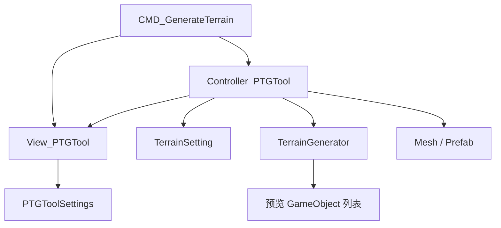

# 程序化地形生成 — 设计说明

## 1. 功能目标

在编辑器中，基于 Perlin 噪声与可配置参数预览程序化 mesh 地形，将参数保存为 `TerrainSetting` ScriptableObject，并将预览结果合并为 Mesh 资源与 Prefab（可选 LOD）。

| 能力 | 说明 |
|------|------|
| 参数编辑 | 尺寸、分块、高度曲线、噪声、LOD、材质、地形类型预设 |
| 配置资产 | 新建或更新 `TerrainSetting` `.asset` |
| 预览 | 分块 mesh 预览，`HideFlags.DontSave`，支持 Undo 创建 |
| 正式输出 | 合并 chunk → 写出 Mesh → 保存 Prefab → 实例化到场景 |
| 会话恢复 | `PTGToolSettings` 保存界面 `Model_PTGTool` |

## 2. 模块划分

| 模块 | 路径 | 职责 |
|------|------|------|
| 入口 | `Editor/Commands/CMD_GenerateTerrain.cs` | 打开/关闭面板（Execute 前先 Dispose 旧实例） |
| 视图 | `Editor/View/View_PTGTool.cs` | 参数表单、LOD、三个操作按钮 |
| 控制 | `Editor/Controller/Controller_PTGTool.cs` | 配置读写、预览生成、保存管线 |
| 参数 | `Editor/Model/Model_PTGTool.cs` | 表单字段与默认值 |
| 设置 | `Editor/Settings/PTGToolSettings.cs` | 跨会话 UI 状态 |
| 生成 | `Editor/Utils/TerrainGenerator.cs` | 高度图、分块 Mesh、LOD 变体、合并 |

`CMD_GenerateTerrain` 只管理面板生命周期；mesh 构建在 `TerrainGenerator` 中。

## 3. 用户界面

### 3.1 分组（自上而下）

| 分组 | 控件 |
|------|------|
| 资源 | 地形配置文件（`TerrainSetting`）、配置文件路径、地形输出路径 |
| 基本 | 地形名称、地形类型（平原/丘陵/山地）、材质 |
| 地形 | 宽 X、长 Z、分块大小、最小/最大高度、高度曲线 |
| 噪声 | 缩放、层数(octaves)、持久度、空隙度 |
| LOD | 开关、等级（1～3 级对应 LOD0～LOD2） |

切换 **地形类型** 时 `UpdateParamByType` 写入推荐噪声与高度参数；加载已有 `TerrainSetting` 时 `OnTerrainSOChanged` 反向填充表单。

### 3.2 底栏

| 按钮 | Controller 方法 | 说明 |
|------|-----------------|------|
| 保存/更新设置 | `UpdateSetting` | 已有 SO 则更新并 `SaveAssets`；否则在配置路径 `CreateAsset` |
| 生成/刷新 | `GenerateTerrain` | 销毁旧预览，按参数生成预览地形 |
| 保存 | `SaveTerrain` | 合并 mesh、写资源、保存 Prefab、实例化到场景 |

### 3.3 视图事件

| 事件 | 触发 |
|------|------|
| `UpdateClicked` | 保存/更新设置 |
| `RefreshClicked` | 生成/刷新 |
| `SaveClicked` | 保存地形到资源与场景 |

## 4. 用户流程

### 4.1 调参并预览

1. 打开 **地形生成** 面板。
2. 设置或加载 `TerrainSetting`，调整表单参数（可选用地形类型预设）。
3. 点击 **生成/刷新**：场景中出现分块预览（LOD 模式下多个根节点横向偏移便于查看）。

### 4.2 保存配置与正式输出

1. **保存/更新设置**：将当前表单写入 `TerrainSetting` 资产。
2. 预览满意后点击 **保存**：合并 chunk → `{name}_Mesh.asset` → `{name}.prefab` → `InstantiatePrefab` 到场景。
3. **保存** 完成后预览列表被销毁，需再次 **生成/刷新** 才能继续调整。

### 4.3 校验

| 条件 | 处理 |
|------|------|
| 新建配置但配置文件路径为空 | 警告，不创建资产 |
| 保存地形但输出路径为空 | 警告，不继续 |
| 无预览对象时保存 | 直接返回 |
| `terrainWidth` / `terrainLength` 与 `chunkSize` | 需整除（分块计数为整数除法） |

## 5. 地形生成（TerrainGenerator）

### 5.1 高度图

`GenerateHeightMap(setting)`：多层 Perlin + `heightCurve` 映射到 `[minHeight, maxHeight]`。

### 5.2 分块 Mesh

按 `terrainWidth/chunkSize × terrainLength/chunkSize` 生成分块子物体，每块 `MeshFilter` + `MeshRenderer` + `MeshCollider`。

### 5.3 LOD 预览

`GenerateTerrainLODs`：各级别降低 mesh 分辨率；多个根节点在 X 轴偏移 `(width+20)*i`，仅便于编辑查看，非运行时布局。

### 5.4 保存管线（SaveTerrain）

1. 对每个预览根节点 `CombineChunkMeshes` → 单 mesh GameObject。
2. `SaveMesh`：实例化 mesh，写入 `TerrainSavePath`，同步 `MeshCollider`。
3. 若启用 LOD：`CreateLODGroup`，屏幕占比由 `GetLODPercents` 计算（首级 0.6，每级 ×0.5）。
4. `PrefabUtility.SaveAsPrefabAsset` → 销毁临时 GO → `InstantiatePrefab` 到场景。
5. 销毁预览与中间合并对象。

## 6. 控制器职责

### 6.1 状态

| 字段 | 说明 |
|------|------|
| `m_terrainSetting` | 运行时 `ScriptableObject.CreateInstance`，由 `CreateSettingData` 同步表单 |
| `m_terrainGOList` | 预览根节点列表（`DontSave`） |

### 6.2 UpdateSetting

已有 `terrainSetting` 引用：`Undo.RecordObject` + `CreateSettingData` + `SaveAssets`；否则在 `ConfigSavePath/{terrainName}.asset` 创建新资产。成功后写入 `PTGToolSettings`。

### 6.3 GenerateTerrain

清除无效预览 → 销毁旧列表 → `CreateSettingData` → `GenerateTerrain` 或 `GenerateTerrainLODs` → `Undo.RegisterCreatedObjectUndo` → 持久化界面状态。

### 6.4 SaveTerrain

校验路径与预览 → 合并 → `SaveMesh` → `CreateLODGroup`（可选）→ `SavePrefab` → 销毁预览与中间对象。

### 6.5 Dispose

解绑事件；`Undo.DestroyObjectImmediate` 清理 `m_terrainGOList` 中所有预览对象。

## 7. 命令生命周期

**Execute**：`Dispose` 旧 Controller → `RemoveElement` → 新建 View、Controller → `AddElement`（避免重复打开残留面板）。

**Undo（关闭面板）**：`Dispose` Controller（销毁预览）→ `RemoveElement` → 清空引用。不自动撤销已 **保存** 的 Mesh / Prefab / 场景实例。

## 8. 参数模型（Model_PTGTool）

| 字段 | 默认值 | 说明 |
|------|--------|------|
| `terrainSetting` | null | 已加载的配置资产引用 |
| `configSavePath` / `terrainSavePath` | — | 配置与 mesh/prefab 输出目录 |
| `terrainName` | `"Terrain"` | 地形与资产命名 |
| `terrainType` | `Plain` | 平原/丘陵/山地预设 |
| `terrainMaterial` | — | 预览与输出材质 |
| `terrainWidth` / `terrainLength` | 256 | 地形尺寸 |
| `chunkSize` | 32 | 分块大小 |
| `minHeight` / `maxHeight` | 0 / 20 | 高度范围 |
| `heightCurve` | Linear(0,0,1,1) | 高度曲线 |
| `noiseScale` | 100 | 噪声缩放 |
| `octaves` | 4 | 层数 |
| `persistence` / `lacunarity` | 0.4 / 1.8 | 持久度、空隙度 |
| `enableLOD` | true | 是否 LOD |
| `lodLevel` | 0 | UI 索引 0～2，写入 `TerrainSetting.lodLevel` 时为 `+1` |

View ↔ `Model_PTGTool` ↔ `CreateSettingData` ↔ `TerrainSetting` 的映射在 Controller 中完成。

## 9. 实现进度

| 项 | 状态 |
|----|------|
| `View_PTGTool` 布局、预设、SO 回填 | 已完成 |
| `CMD_GenerateTerrain` 打开/关闭（含重复打开清理） | 已完成 |
| 预览生成（含 LOD） | 已完成 |
| 保存配置、保存 Mesh/Prefab | 已完成 |
| `Dispose` 清理预览 | 已完成 |
| 新噪声类型 / 生物群系 | 未实现 |

## 10. 待办

- [ ] `terrainWidth`、`terrainLength` 不能整除 `chunkSize` 时的明确校验与提示
- [ ] 保存后可选保留预览以便连续迭代
- [ ] LOD 预览布局与运行时布局分离的配置项
- [ ] 扩展 `TerrainType` 预设与 `GenerateHeightMap` 算法
