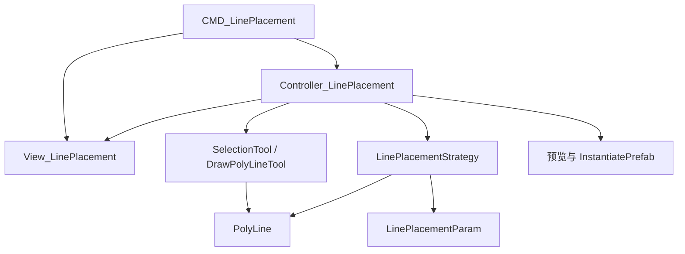

# 沿线布设 — 设计说明

## 1. 功能目标

在编辑器中，沿一条或多条 `PolyLine` 路径，按给定规则批量放置 Prefab 实例。


| 能力     | 说明                                                               |
| ---------- | -------------------------------------------------------------------- |
| 路径来源 | 选择场景中已有`PolyLine`；或通过「绘制并布设」当场绘制新路径后布设 |
| 放置规则 | 弧长等距、`offsetStart` / `offsetEnd`、固定或随机绕轴旋转          |
| 交互     | 预览临时对象；确定写入场景并支持 Undo；取消仅撤销预览              |
| 多路径   | 支持一次选中多条曲线，分别采样并布设                               |

## 2. 模块划分




| 模块 | 路径                                            | 职责                                      |
| ------ | ------------------------------------------------- | ------------------------------------------- |
| 入口 | `Editor/Commands/CMD_LinePlacement.cs`          | 打开/关闭布设面板                         |
| 视图 | `Editor/View/View_LinePlacement.cs`             | 参数表单、路径状态、操作按钮              |
| 控制 | `Editor/Controller/Controller_LinePlacement.cs` | 校验、选线/画线、调用策略、驱动预览与提交 |
| 策略 | `Editor/…/LinePlacementStrategy.cs`（待实现）  | 沿路径计算位姿列表                        |
| 参数 | `Model/PlacementParam/LinePlacementParam.cs`    | 间距、偏移、旋转配置                      |

`CMD_LinePlacement` 只管理面板生命周期；采样与放置逻辑不在命令类中实现。

## 3. 用户界面

### 3.1 分组（自上而下）


| 分组     | 控件                                            |
| ---------- | ------------------------------------------------- |
| 布设内容 | 模型（Prefab`ObjectField`）                     |
| 沿线分布 | 间隔、起点偏移、终点偏移                        |
| 朝向     | 随机旋转；旋转角度 / 旋转角度范围（二选一显示） |
| 布设路径 | 选择曲线、`Label`（已选条数）                   |

### 3.2 底栏


| 左侧       | 右侧                 |
| ------------ | ---------------------- |
| 绘制并布设 | 预览 · 确定 · 取消 |

### 3.3 视图事件


| 事件                   | 触发       |
| ------------------------ | ------------ |
| `SelCurves`            | 选择曲线   |
| `DrawAndPlaceBtnClick` | 绘制并布设 |
| `PreviewBtnClick`      | 预览       |
| `OkClick`              | 确定       |
| `CancelClick`          | 取消       |

## 4. 用户流程

### 4.1 沿已有路径布设

1. 打开沿线布设面板。
2. 设置模型与布设参数。
3. 点击「选择曲线」，在场景中多选带 `PolyLine` 的对象，空格确认。
4. 「预览」查看临时实例；「确定」正式创建；「取消」清除预览并关闭面板逻辑（见 6.3）。

### 4.2 绘制新路径并布设

1. 设置模型与布设参数（可不选已有曲线）。
2. 点击「绘制并布设」，进入 `DrawPolyLineTool` 绘制折线。
3. 完成绘制后得到新 `PolyLine`，按当前参数自动执行与「确定」相同的布设。
4. 绘制过程中取消 → 不创建路径、不布设。

### 4.3 校验（预览 / 确定 / 绘制并布设前）


| 条件                      | 处理         |
| --------------------------- | -------------- |
| 未指定模型                | 提示，不继续 |
| `spacing ≤ 0` 等非法参数 | 提示，不继续 |
| 预览 / 确定且未选曲线     | 提示，不继续 |
| 路径点数不足 2            | 提示，不继续 |

## 5. 布设策略（LinePlacementStrategy）

### 5.1 输入

- `LinePlacementParam`：`spacing`、`offsetStart`、`offsetEnd`、`randomRotation`、`rotation`、`rotationRange`
- 一条或多条 `PolyLine`（世界空间折线）

### 5.2 采样规则

1. 将 `PolyLine.Points` 变换到世界坐标；若 `Closed`，增加首尾连接段。
2. 计算折线总弧长 `L`；有效区间为 `[offsetStart, L - offsetEnd]`，若区间无效则返回空。
3. 从有效起点起，按 `spacing` 弧长步进采样，直至超出有效终点。
4. 每点取世界位置；切线方向由所在线段确定。
5. 旋转：非随机时使用 `rotation`（绕 Y 轴，实现时固定约定）；随机时在 `rotationRange` 内取值。多条路径共用同一随机序列规则时，实现中需约定是否按路径重置种子。

### 5.3 输出

```csharp
// 示意
struct PlacementPose {
    Vector3 position;
    Quaternion rotation;
}
IReadOnlyList<PlacementPose> Compute(LinePlacementParam param, PolyLine path);
```

对多条路径：对每条路径分别 `Compute`，合并或分批交给 Controller 实例化。

## 6. 控制器职责

### 6.1 状态


| 字段               | 说明                               |
| -------------------- | ------------------------------------ |
| `m_selectedCurves` | 已选路径`GameObject` 列表          |
| 预览对象列表       | 带`HideFlags.DontSave` 的临时实例  |
| 当前面板参数       | 由 View 组装为`LinePlacementParam` |

### 6.2 选线（已实现）

`SelectionTool` 多选、`typeof(PolyLine)` 过滤；回调更新 `m_selectedCurves` 与 `View.Label`（`已选曲线：{n}`）。

### 6.3 预览

1. 校验通过。
2. 清除上一轮预览对象。
3. 对每条选中路径调用 `LinePlacementStrategy`，`PrefabUtility.InstantiatePrefab` 生成临时对象并记录。
4. 不在此步注册创建 Undo。

### 6.4 确定

1. 校验通过。
2. 清除预览对象。
3. 同样采样并 `InstantiatePrefab`，对每次创建调用 `Undo.RegisterCreatedObjectUndo`。
4. 父节点：默认场景根，或挂到对应 `PolyLine` 的 GameObject（实现时二选一并写死）。

### 6.5 取消

1. 销毁所有预览对象。
2. 不修改已正式提交的场景实例。
3. 关闭面板由 `CMD_LinePlacement.Undo` / 用户切换工具触发 `Controller.Dispose`。

### 6.6 绘制并布设（待实现）

1. 校验 Prefab 与参数。
2. `EditorToolManager.SetTool(new DrawPolyLineTool(onComplete))`。
3. `onComplete` 内取得新 `PolyLine`，调用与 6.4 相同的布设流程。

### 6.7 Dispose

解绑 View 事件；销毁未清理的预览对象。

## 7. 命令生命周期

**Execute**：`Dispose` 旧 Controller → `RemoveElement` → 新建 View、Controller → `AddElement`。

**Undo（关闭面板）**：`Dispose` Controller → `RemoveElement` → 清空引用。不自动撤销已「确定」写入场景的实例。

## 8. 参数模型（LinePlacementParam）


| 字段             | 默认值   | 说明              |
| ------------------ | ---------- | ------------------- |
| `spacing`        | 1.0      | 沿弧长步进距离    |
| `offsetStart`    | 0        | 起点弧长偏移      |
| `offsetEnd`      | 0        | 终点弧长偏移      |
| `randomRotation` | false    | 是否随机 Y 轴旋转 |
| `rotation`       | 0        | 固定旋转（度）    |
| `rotationRange`  | (0, 360) | 随机旋转范围      |

View 字段与 `LinePlacementParam` 的映射在 Controller 中完成（待实现）。

## 9. 实现进度


| 项                                | 状态   |
| ----------------------------------- | -------- |
| `View_LinePlacement` 布局与事件   | 已完成 |
| `CMD_LinePlacement` 打开/关闭面板 | 已完成 |
| 选择曲线、更新 Label              | 已完成 |
| `LinePlacementStrategy`           | 未实现 |
| View →`LinePlacementParam`       | 未实现 |
| 预览 / 确定 / 取消                | 未实现 |
| 绘制并布设                        | 未实现 |
| `OnPrefabChanged`                 | 空     |

## 10. 待办

- [ ]  实现 `LinePlacementStrategy`（弧长表、采样、位姿）
- [ ]  Controller：从 View 构建 `LinePlacementParam`
- [ ]  Controller：预览 / 确定 / 取消
- [ ]  Controller：`DrawPolyLineTool` 完成回调 + 布设
- [ ]  校验失败时的用户提示
- [ ]  `Dispose` 时清理预览
- [ ]  移除 `CMD_LinePlacement` 内无用注释代码
