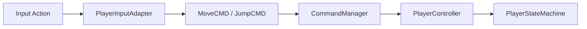

# EchoKnight

> 基于 Unity 2022.3 LTS 开发的 RPG 场景编辑工具与角色控制项目。

EchoKnight 主要围绕 RPG 场景内容生产展开，包含程序化地形生成、Scene View 曲线绘制、沿线物件布设和配置数据转换等编辑器工具。

项目同时实现了角色输入、命令模式和分层状态机等运行时模块，用于探索编辑器工具、数据配置与游戏逻辑之间的协作方式。

---

## 项目结构

```text
Assets/
├── Echo/
│   ├── Editor/
│   │   ├── Commands/       # 编辑器命令
│   │   ├── Controller/     # 功能流程控制
│   │   ├── Core/           # 命令、工具和 Undo 基础设施
│   │   ├── Model/          # 编辑器数据模型
│   │   ├── Tool/           # Scene View 交互工具
│   │   ├── UI/             # UI Toolkit 自定义控件
│   │   ├── Utils/          # 地形、噪声、文件和数据工具
│   │   └── View/           # 编辑器窗口与功能面板
│   └── Runtime/
│       ├── Components/     # 曲线、布设和运行时组件
│       ├── Core/           # 接口、属性、命令和基础类型
│       ├── Model/          # 可序列化参数
│       └── Utils/          # 几何与 GameObject 工具
└── Game/
    ├── Configs/            # 输入与示例配置
    ├── Prefabs/            # 角色和地形 Prefab
    ├── Scenes/             # 游戏及工具验证场景
    └── Scripts/            # 角色控制、命令和分层状态机
```

---

## 编辑器架构

编辑器模块以 MVC 为主体进行组织：

- Model：保存工具参数、表格数据和可序列化配置
- View：使用 UI Toolkit 构建界面，并发送用户操作事件
- Controller：协调 View 与 Model，组织预览、生成和保存流程
- Command：负责工具的创建、激活和停用
- Tool：负责 Scene View 输入、绘制和对象选择
- Utils：提供噪声、地形、几何、文件和数据处理能力
- Runtime：提供曲线、布设策略和通用运行时组件

---

## 功能模块

### RPG Editor Tool

项目使用 UI Toolkit 构建了统一的 RPG 编辑器窗口，入口位于：`Tools > RPG Editor Tool`。编辑器窗口由工具树、功能面板和状态栏组成，目前包含以下工具：

```text
绘制工具
├── 绘制圆弧
├── 绘制圆
└── 绘制多段线

场景编辑
├── 地形生成
└── 沿线布设

配置数据
└── CSV 转 ScriptableObject
```

工具列表通过 `Command.xml` 配置，由 `CommandRegistry` 创建对应命令。`CommandManager` 负责维护当前活动命令。切换工具时会停用上一个命令，避免多个 Scene View 工具同时处理输入。

### 程序化地形生成

地形生成工具通过多层 Perlin Noise 创建高度图，并将高度数据转换为 Unity Mesh。

支持的参数包括：

- 地形宽度和长度
- Chunk 大小
- 最小与最大高度
- Noise Scale
- Octaves
- Persistence
- Lacunarity
- 高度映射曲线
- LOD 等级
- 地形材质

生成流程：


工具支持实时预览、参数刷新、配置保存和最终资源生成。地形参数通过 `TerrainSetting` ScriptableObject 保存，可以在不同地形配置之间复用。

### 曲线系统

项目实现了统一的 `Curve` 抽象，并提供三种曲线类型：

- PolyLine
- Circle
- Arc

曲线接口统一定义了：

- 曲线类型
- 曲线长度
- 起点与终点
- 参数化位置计算
- 按间距采样
- 世界坐标转换
- 拾取距离计算

Scene View 绘制工具支持通过鼠标创建圆、圆弧和多段线。

曲线对象通过自定义 Handles 和 Gizmos 显示。多段线控制点可以直接在 Scene View 中拖拽编辑，开放多段线和闭合多段线使用同一套数据结构与采样逻辑。

### 自定义拾取系统

为了支持没有标准 Renderer 或 Collider 的曲线对象，项目实现了独立的拾取系统。

`PickManager` 维护所有可拾取对象，`PickController` 根据鼠标位置计算曲线与屏幕坐标之间的距离，并结合 Unity 默认拾取结果选择目标对象。

该系统用于：

- 曲线对象选取
- 沿线布设目标选择
- 自定义 Scene View 工具交互
- 闭合与开放多段线的距离检测

### 沿线布设

沿线布设工具根据多段线计算采样位置，并在采样点创建指定 Prefab。

支持的参数包括：

- 布设间距
- 起点横向偏移
- 终点横向偏移
- 固定旋转角度
- 随机旋转范围
- 地表检测 LayerMask

布设算法首先计算每段线段长度与曲线总长度，然后使用累计距离进行连续采样，避免在多段线拐点处重新开始计数。

每个采样点会执行以下计算：

1. 在线段上插值得到基础位置。
2. 根据曲线总进度插值横向偏移。
3. 根据线段切线计算模型基础朝向。
4. 叠加固定角度或随机旋转。
5. 向指定图层的碰撞体发射射线。
6. 将模型高度调整到命中的地表位置。

工具提供预览、参数刷新、确定和取消操作，并支持同时处理多条曲线。

### CSV 转 ScriptableObject

CSV 工具用于在表格配置和 Unity ScriptableObject 之间转换数据。

当前实现以角色物理配置为示例，包含：

- 角色类型
- 重力
- 地面重力
- 旋转速度
- 最大跳跃高度
- 最大跳跃时间

工具支持：

- 读取 CSV 文件
- 在编辑器窗口中显示表格
- 编辑单元格数据
- 将表格写回 CSV
- 批量创建 ScriptableObject
- 批量更新已有 ScriptableObject

配置类型通过自定义特性注册：

- `ConfigInfoAttribute` 定义配置类型的显示名称
- `ConfigFieldAttribute` 定义字段对应的表头名称

Controller 使用反射读取字段及其特性，因此后续可以继续增加新的配置类型。

### Undo / Redo

项目将编辑器操作接入 Unity 原生 Undo 系统。通过 `EditorUndoUtility` 对常用操作进行了统一封装，包括：

- 记录对象修改前的状态
- 注册新创建对象
- 删除对象
- 添加组件
- 修改 Transform 父子关系

`EditorUndoScope` 则用于将一次功能操作产生的多个底层修改合并成一条 Undo 记录。

当前支持 Undo/Redo 的操作包括：

- 创建圆、圆弧和多段线
- 拖拽多段线控制点
- 生成地形场景实例
- 修改已有地形配置
- 批量更新已有配置 ScriptableObject
- 创建和重新生成沿线布设对象

预览对象使用 `DontSaveInEditor` 标记，并在刷新、取消或关闭工具时主动清理，避免预览数据写入场景或进入 Undo 栈。

### 分层状态机

角色控制使用父状态与子状态组合的分层状态机。父状态分为：`Grounded`、`Airborne`，每个父状态维护自己的子状态集合：

```text
Grounded
├── Idle
├── Walk
└── Run

Airborne
├── Jump
└── Falling
```

所有状态继承自 `PlayerBaseState`，并通过统一生命周期运行：

```csharp
EnterState();
UpdateState();
ExitState();
```

`PlayerStateMachine` 保存当前父状态、移动输入、垂直速度以及跳跃标记等共享上下文。

`PlayerParentState` 负责：

- 注册和管理所属子状态
- 更新当前子状态
- 检查父状态切换
- 检查子状态切换
- 保证状态切换时正确调用退出和进入逻辑

地面状态根据输入在 `Idle`、`Walk` 和 `Run` 之间切换。当角色主动跳跃或离开地面时，状态机从 `Grounded` 切换到 `Airborne`。

空中状态持续计算重力。当垂直速度由正变为非正时，子状态从 `Jump` 切换为 `Falling`；检测到角色重新接地后，再切换回 `Grounded`。

### 输入与命令系统

角色输入基于 Unity Input System 实现。`PlayerInputAdapter` 将 Input Action 回调转换为命令对象，再交由运行时 `CommandManager` 执行：



这种方式将输入来源与角色行为分离，使角色控制逻辑不直接依赖具体按键。

---

## 后续方向

- 区域布设
- 按地形高度或颜色进行物件布设
- 为地形生成增加固定随机种子，使相同参数与 Seed 可以复现相同的地形结果
- 接入智能体，通过自然语言与结构化指令辅助场景设计及角色行为树构建
